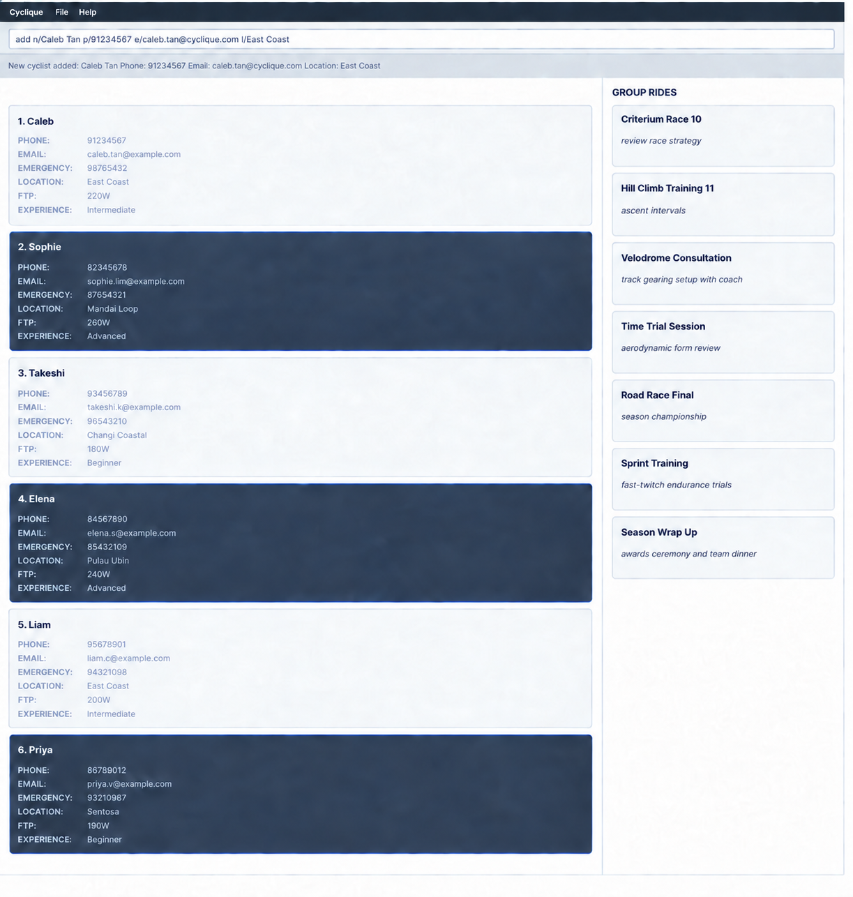

* Cyclique is a **desktop app for organisers of recreational cycling groups in Singapore**, optimised for use through a Command Line Interface (CLI) while still giving you the benefits of a Graphical User Interface (GUI).
* Organisers often have their riders' contact and information scattered across chats, spreadsheets, and memory, making it hard to tell who's actually suitable for a given ride. Cyclique keeps this information in one place and helps you quickly find which riders suit a ride, based on experience, location, availability, and preferences.
  * It's built for organisers who need to manage a significant number of cyclists, quickly access cyclists' contact and emergency information, and identify available cyclists by factors such as preferred cycling location, FTP, and experience level.
* If you're comfortable typing and using CLI apps, Cyclique can help you manage and match cyclists faster than a typical GUI app.
* For the detailed documentation of this project, see the **[Cyclique Product Website](https://ay2627s1-cs2103t-w11-1.github.io/tp/)**.

* This project is based on the [AddressBook-Level3](https://github.com/se-edu/addressbook-level3) project created by the [SE-EDU initiative](https://se-education.org/).
