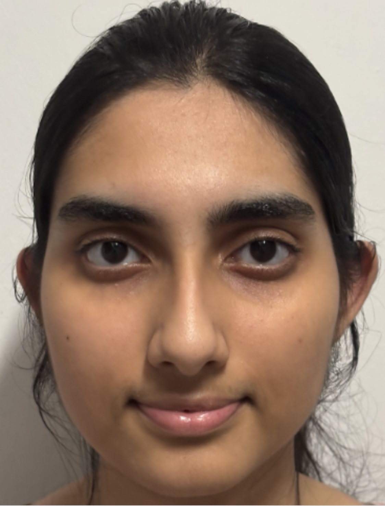

We are a team based in the [School of Computing, National University of Singapore](https://www.comp.nus.edu.sg).

You can reach us at the email `seer[at]comp.nus.edu.sg`

## Project team

### Evan Liang Song Xun

[[github](https://github.com/elsxyss)]

* Role: Team Lead, Scheduling and Tracking
* Responsibilities: Coordinates the project and tracks tasks.

### Sia Pathania

[[github](https://github.com/Sia-Pathania)]

* Role: Integration, Deliverables and Deadlines, Storage Lead
* Responsibilities: Manages integration and Storage, and ensures correct, timely submissions.

### Tan Ji Xiang

[[github](https://github.com/jixiang-t)]

* Role: Testing, Logic Lead
* Responsibilities: Oversees testing and Logic quality.

### Jayden Leung

[[github](http://github.com/jaydenleungky)]

* Role: Documentation, UI Lead
* Responsibilities: Maintains documentation and UI quality.

### Juin Ron

[[github](https://github.com/juinron)]

* Role: Code Quality, Model Lead
* Responsibilities: Enforces coding standards and maintains Model quality.
