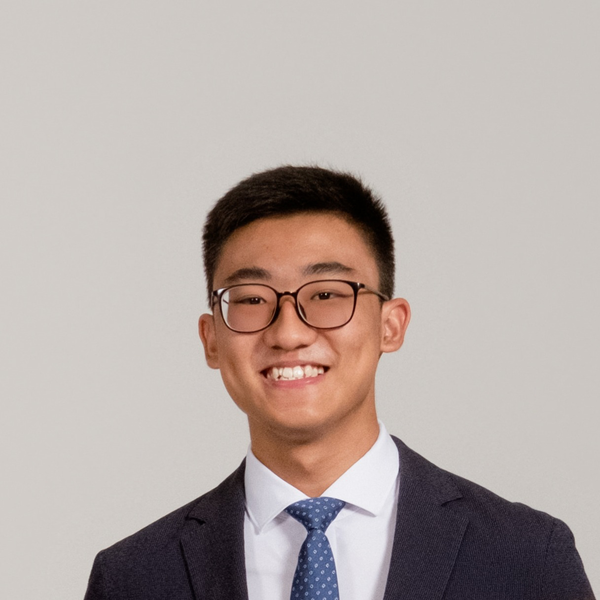
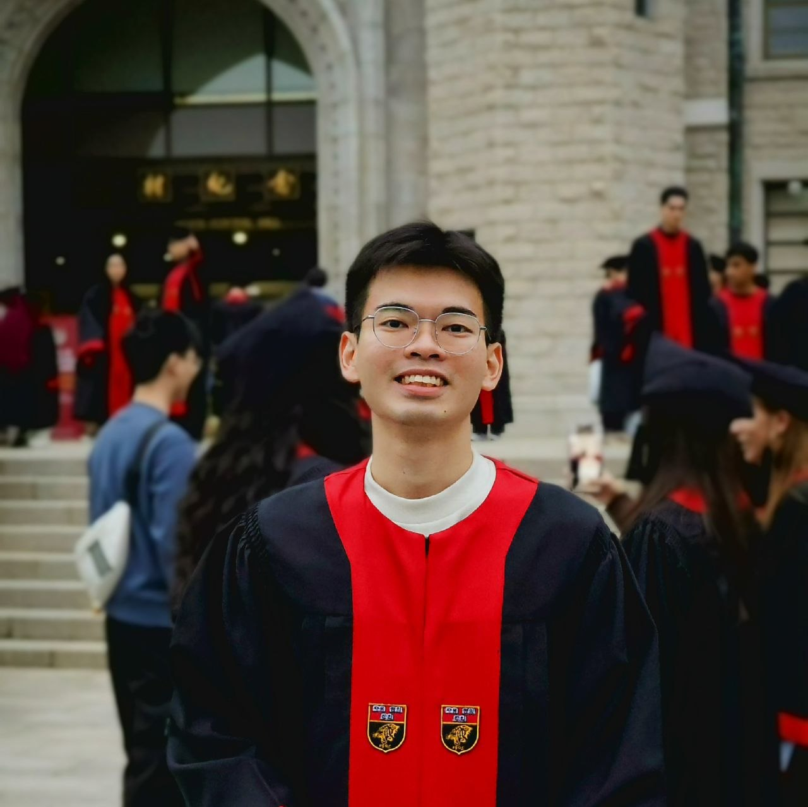
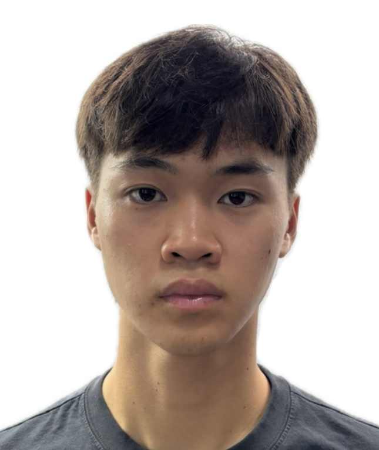
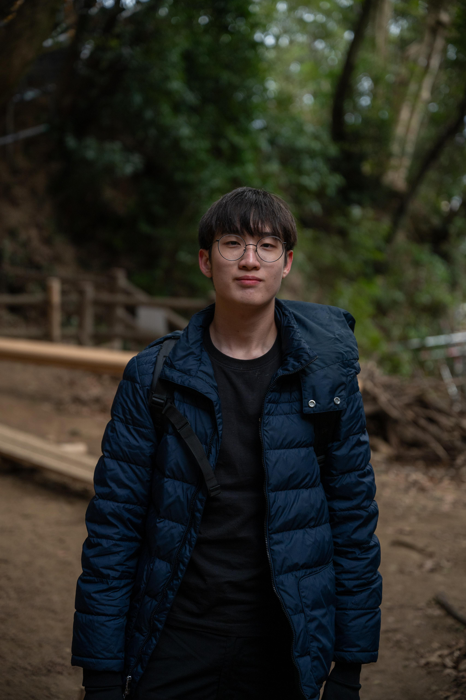

We are a team based in the [School of Computing, National University of Singapore](https://www.comp.nus.edu.sg).

You can reach us at the email `seer[at]comp.nus.edu.sg`

## Project team

### Evan Liang Song Xun

[[homepage](http://www.comp.nus.edu.sg/~damithch)]
[[github](https://github.com/elsxyss)]
[[portfolio](team/johndoe.md)]

* Role: Project Advisor

### Sia Pathania

[[github](https://github.com/Sia-Pathania)]
[[portfolio](team/johndoe.md)]

* Role: Team Lead
* Responsibilities: UI

### Tan Ji Xiang

[[github](https://github.com/jixiang-t)] [[portfolio](team/jixiang-t.md)]

* Role: Developer
* Responsibilities: Data

### Jayden Leung

[[github](http://github.com/jaydenleungky)]

* Role: Developer
* Responsibilities: Dev Ops + Threading

### Juin Ron

[[github](https://github.com/juinron)]

* Role: Developer
